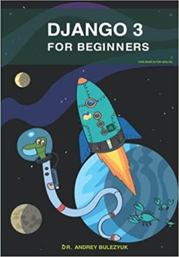

  <b>A tutorial in my <a href="https://github.com/abeerration/CS-Self-Education">CS Self Education</a> series</b>
  <h1>Django for Beginners</h1>

---

## Prerequisites

None

## Description & Goals

This tutorial is about learning Django web app development.

---

## Materials

| # | Cover | Title |
| ----------- | ----------- | ----------- |
| **1.** |  | <h4><i>Andrey Bulezyuk</i></h4><h2>Django 3 for Beginners</h2><h4>GitHub: [https://github.com/AndreyBulezyuk/Django-3-Book](https://github.com/AndreyBulezyuk/Django-3-Book)</h4>
2021

<i>Book</i>
 |

---

## Course Work

| # | Chapter | Project Code |
| ----------- | ----------- | ----------- |
| **1.** | Python 3 | [code](https://github.com/abeerration/Django-for-Beginners/tree/main/1-python3) |
| **2.** | Django 3 | [code]() |
| **3.** | Basics | [code]() |
| **4.** | Application | [code]() |
| **5.** | Views | [code]() |
| **6.** | Advice | [code]() |
| **7.** | REST API - DRF | [code]() |
| **8.** | Cloud Deploy | [code]() |
